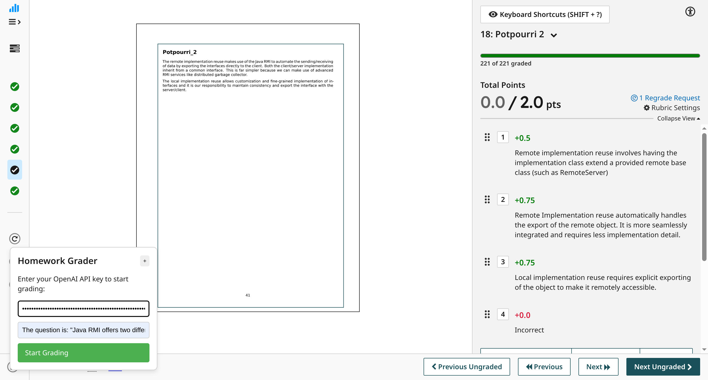
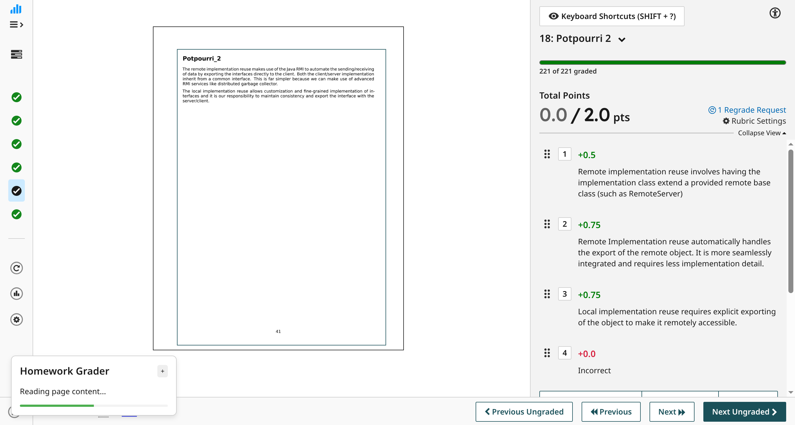
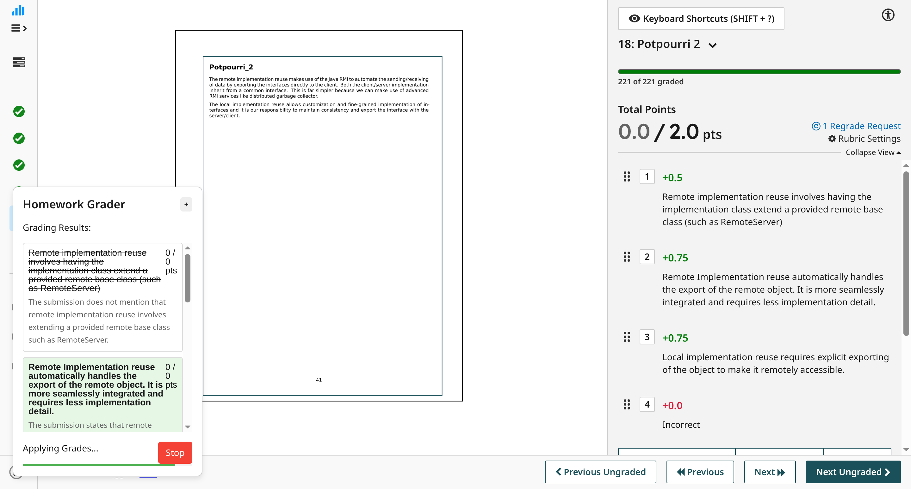

# 🤖 Gradescopt Grader
Takes the current open page and the open rubric, tries to make GPT-4o grade it.

**Disclaimer:**  
🚨 **Work in progress!** 🚨  
This project isn't ready for prime-time grading yet. Don't trust it with your job.

## How to Use
1. **Open Chrome Extension page**:  
   - Go to `chrome://extensions/`, or  
   - Navigate via *Menu > More Tools > Extensions*.

2. **Enable Developer Mode**:  
   - Toggle on **Developer mode** (top right corner).

3. **Load the extension**:  
   - Click **"Load unpacked"**.  
   - Navigate to and select your extension directory.

## 📌 TODO:
- [ ] Improve prompt
- [ ] Include question in the prompt
- [ ] Make it work with different grading configurations (eg. text inputs, multiple scanned pages)
- [ ] Save extension state like: API key, prompts
- [ ] Allow edits to extracted rubric
- [ ] Some way to iterate on prompt construction, by giving feedback to the LLM grader

## Screenshots
 
 
 
